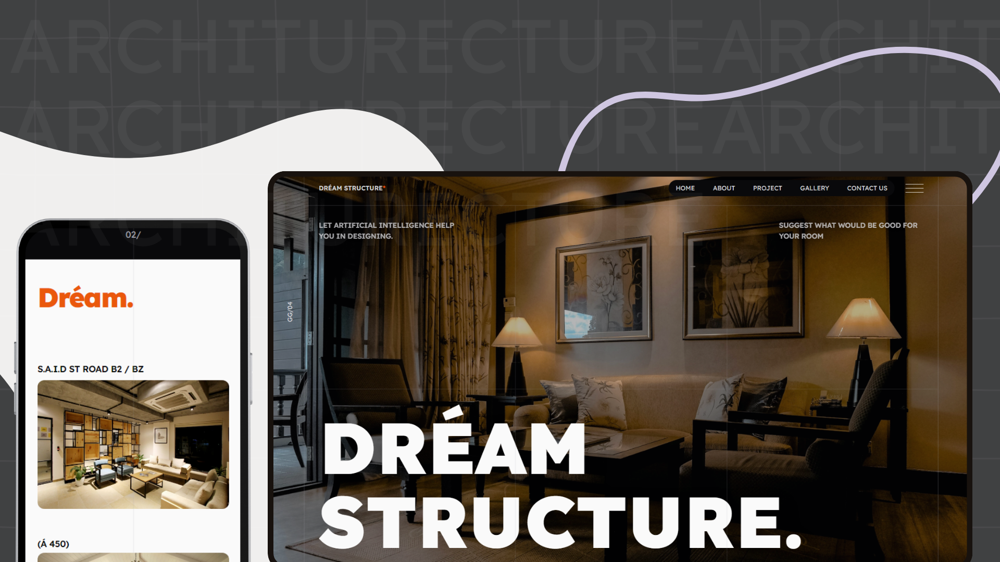

# NextJS Front End Project Dream Structure 📏

## A fully functional landing page built with Next.js and TailwindCSS.
This landing page was developed to be part of Dream Structure's website. The intention of this project is to get leads to their website. It works amazingly with SEO, it has some great styling and trully shows what the platform is up to.


## Technologies 👩‍💻

- Next.js
- React.js
- TailwindCSS
- Framer Motion
- TypeScript

## Authors

- [@gustavogarciac](https://www.github.com/gustavogarciac)


## Image Preview ✨




## Deploy 🚀

You can access the deploy of the project on the link below:

https://dream-structure.vercel.app


## Run Locally

First of all, you must clone the project to your own computer.

```bash
  git clone https://github.com/gustavogarciac/dream-structure.git
```

Get into the project's directory.

```bash
  cd dream-structure
```

Install dependencies

```bash
  pnpm install
```

Run the server

```bash
  pnpm run dev
```


## Support

If you find any mistake or bug, please contact me via gustavogarciaci1@gmail.com.

